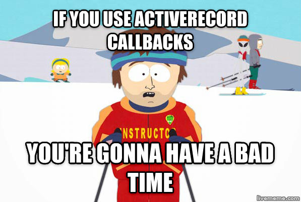

As a Rails application grows and evolves. Fat models often become rampant in the
application. ActiveRecord callbacks are used and models start interacting with
other models in ways they should not.



Enter the idea of "dumb data objects". It is nothing more than a simple data
structure. It holds state and that is it. Only methods that display data or
modify the internal state should be on the model.

This is of course very opinionated, but I do believe it has a lot of merit.

```ruby
# app/models/user.rb
class User < ActiveRecord::Base
  def activate
    active = true
    self.save
  end

  def deactivate
    active = false
    self.save
  end
end
```

```ruby
# app/services/create_user.rb
class CreateUser
  attr_reader :user

  def initialize(params={})
    @user = User.new(params)
  end

  def execute
    @user.save ? @user : false
  end
end
```

Instead of having all the heavy lifting done with the models. The idea is to
shift the burden to [Service Objects][service-objects],
[Query Objects](query-objects), and form objects.

Remember, Rails is just a large library of Ruby code. You are simply working
with Ruby objects. Nothing is forcing us to stuff everything into models. It
took me over a year to figure that out when I first started using Rails.

## Quick Questions

> What can I do to replace my ActiveRecord callbacks?

You wont need to replace them completely. If and only if the callback is
modifying internal state alone, then the callback doesn't necessarily need to be
removed. However, if it is creating other objects and or modifying external
resources, it should be moved into the service object.

> Where can state machines fit into this?

The answer is simple, state machines will reside within the model it is intended
for. Remember, my definition of dumb data objects are objects whose methods only
modify internal state or transform data residing on that object.

## Resources

 * [Service Objects][service-objects]
 * [Query Objects][query-objects]

[service-objects]: /blog/2013/07/03/services-and-pub-sub
[query-objects]: /blog/2013/04/19/query-objects
