I have been hard at work over my birthday to now. I've spent the better part of
20 hours with my dad working on my new standing desk. Where I was working before
was extremely cluttered and an upgrade to my life was needed.

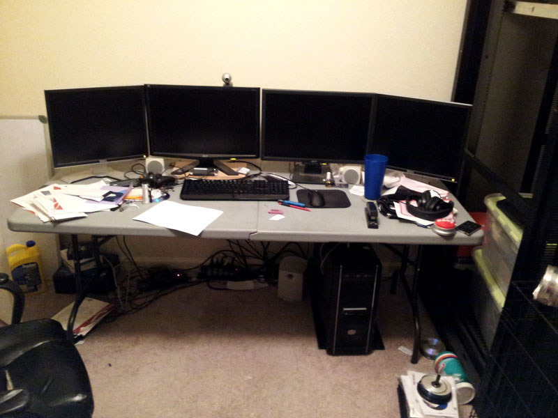

I wasn't able to take pictures from the initial start of the project, due to us
having to do multiple things at once before Home Depot closed. However, after we
settled down, I had Amanda come out and take pictures as we were working on the
desk.

We built the desk using Oak tongue and groove boards. My parents finished an
interior remodel of their house about two years ago. A lot of oak boards were
left over and my dad suggested we use it instead of buying a new sheet of Birch.

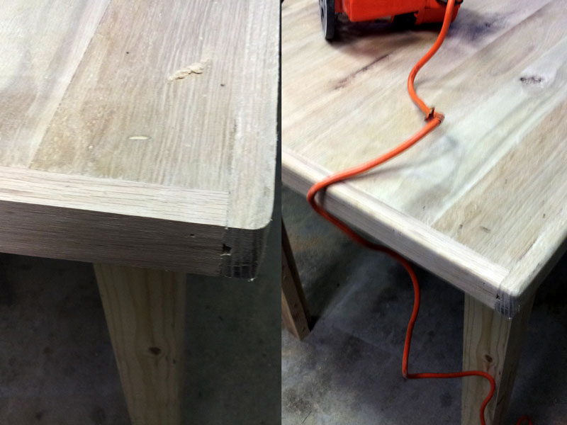

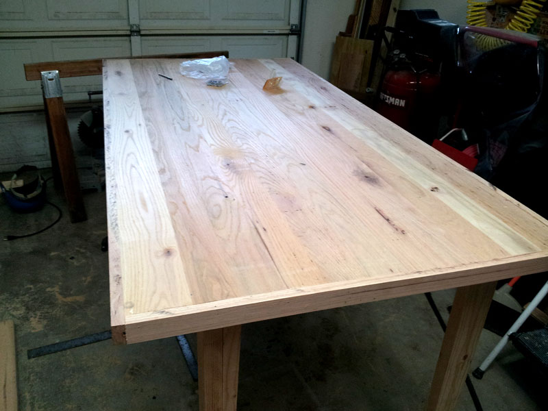

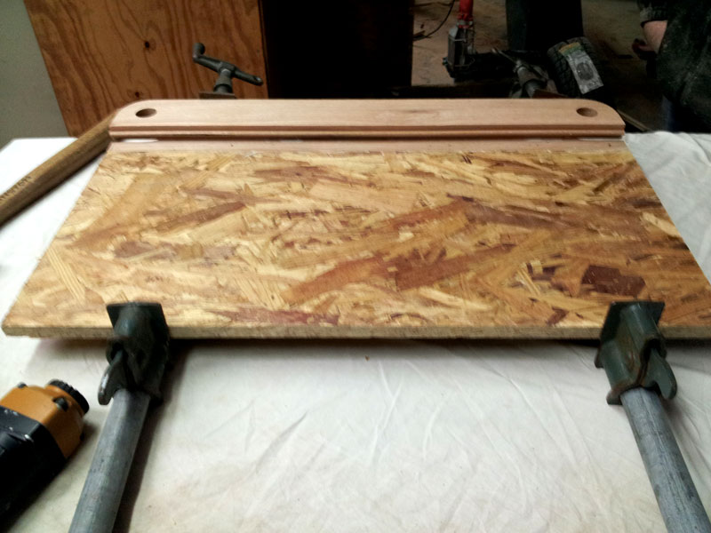

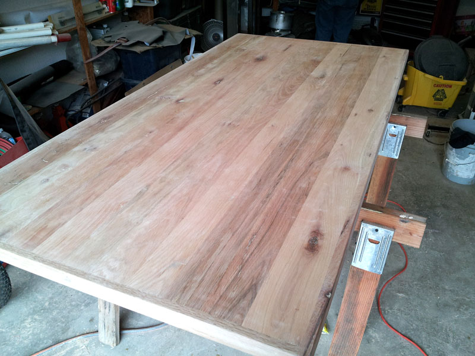

I hate glossy polyurethane. Even a satin finish still bothers me some. For me
wood isn't supposed to be reflective. I opted for a Matte finish with a Dark
Walnut stain.

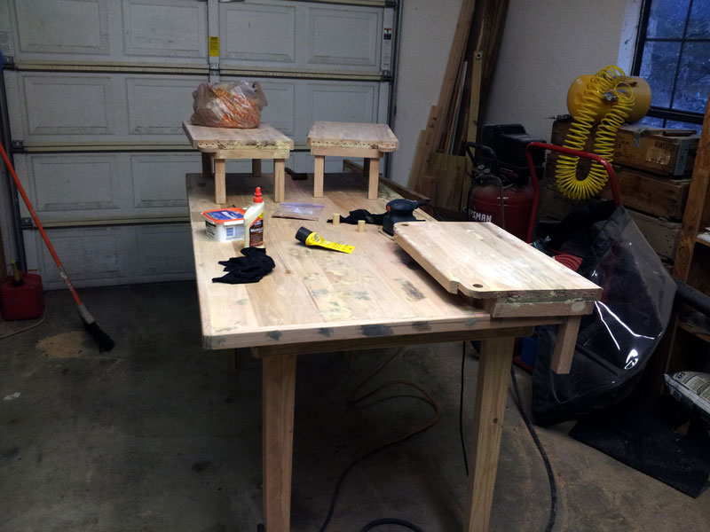

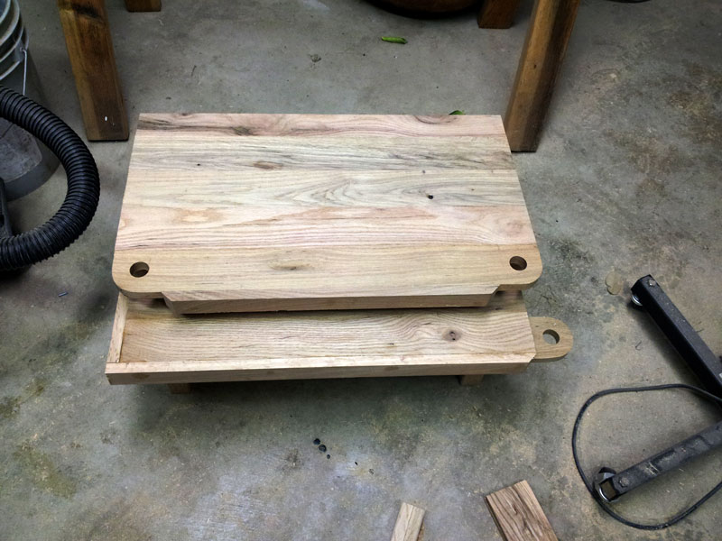

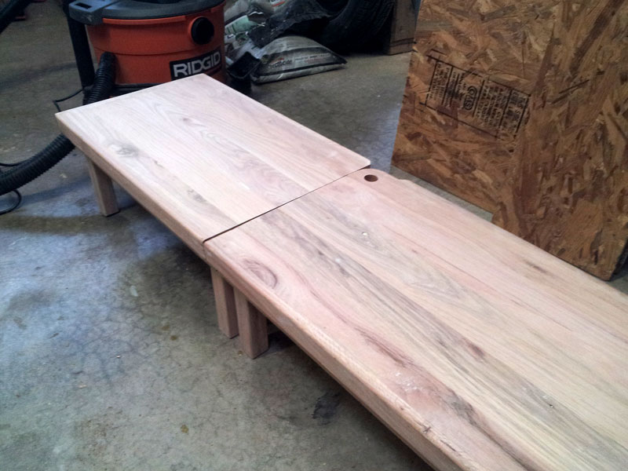

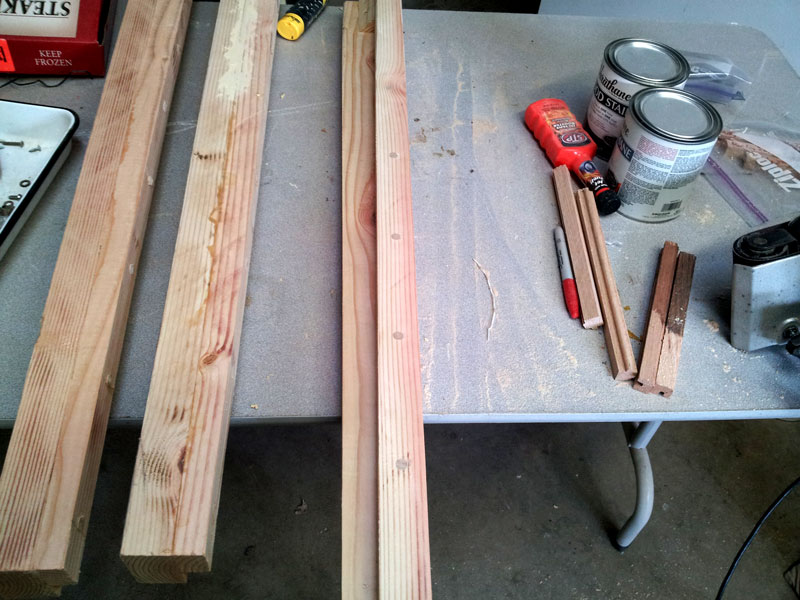

Staining was probably the best feeling in the world. I was so close to being
done!

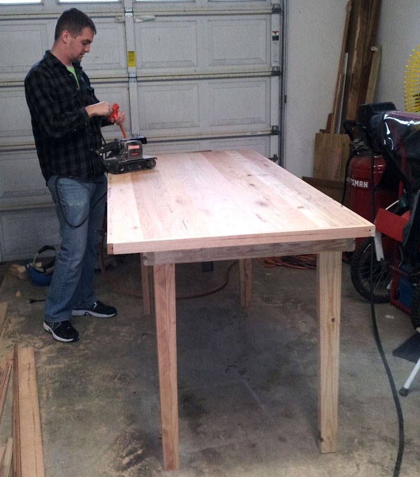

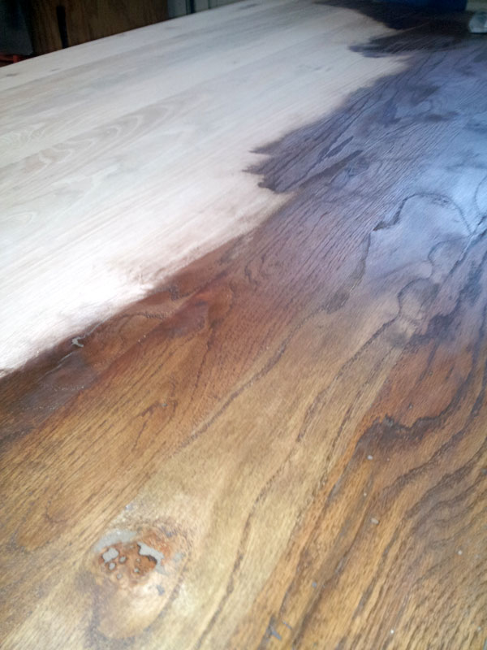

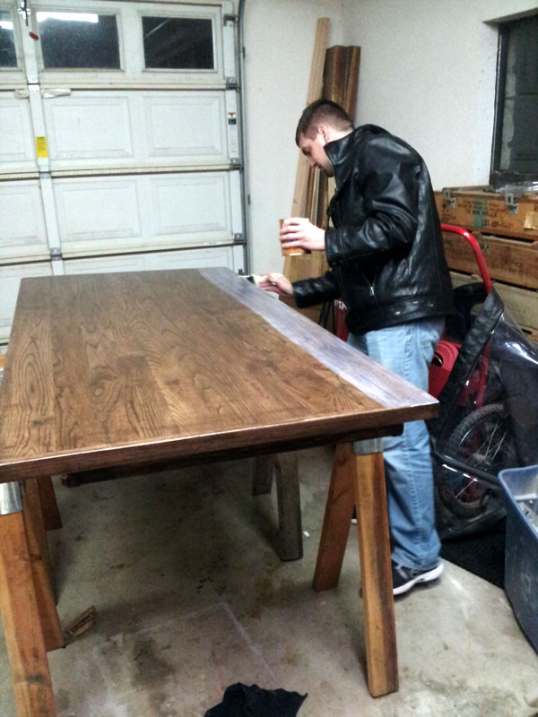

After three layers of polyurethane and some serious tender love and care. I took
it home with me to assemble! This table is super heavy due to all the Oak that
we used.

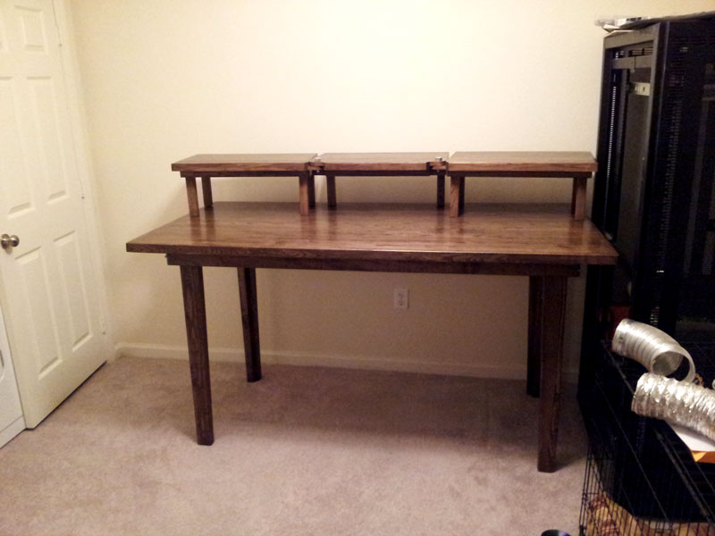

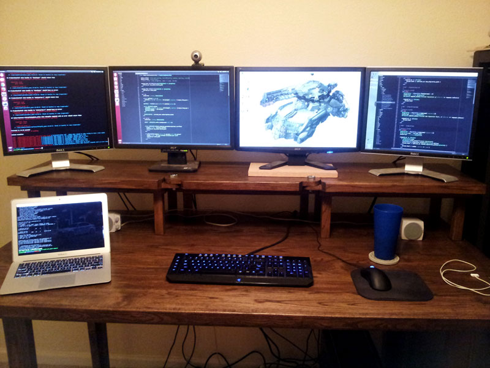

Feels great now that I have this completed!

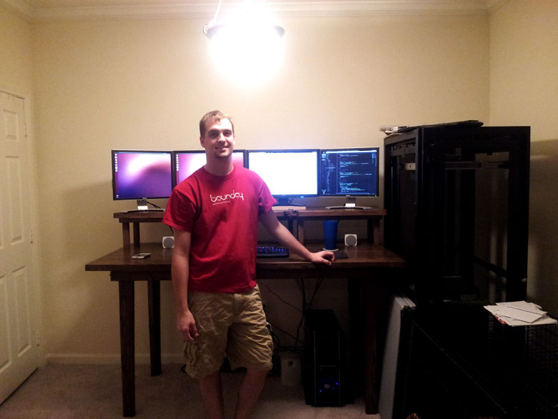
